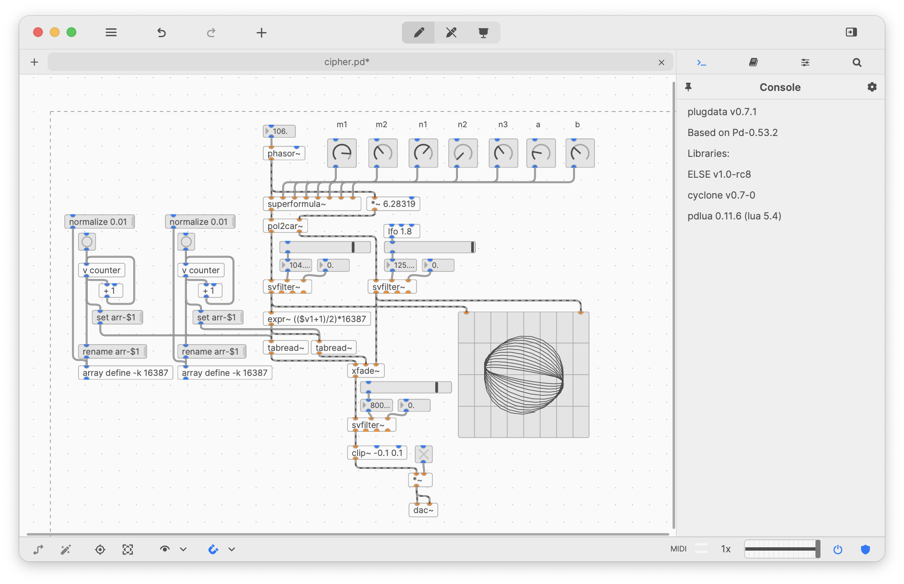

# plugdata - a plugin wrapper for Pd

Welcome to the plugdata wiki!

**plugdata** is a plugin wrapper for Miller Puckette's Pure Data ([Pd](http://msp.ucsd.edu/software.html)), featuring a new GUI made with JUCE. Headed by Timothy Schoen, this project is still a work in progress, and may still have some bugs. By default, plugdata ships with the [cyclone](https://github.com/porres/pd-cyclone) and [ELSE](https://github.com/porres/pd-else) collections of externals and abstractions, and [pd-lua](https://agraef.github.io/pd-lua/) is included as a scripting extension for programming your own Pd objects in [Lua](https://www.lua.org/). The aim is to provide a more comfortable patching experience which integrates well with a large selection of DAW (digital audio workstation) programs. A stand-alone executable version of plugdata is also included, which can be used as a replacement for the Pd program.

Please check the sidebar for installation and basic usage information. More information about the current state of the software can be found in the [main repository](https://github.com/plugdata-team/plugdata). You might also want to check out the [develop branch](https://github.com/plugdata-team/plugdata/tree/develop) for the latest development sources.

**Ardour** and **REAPER** users: If you have trouble editing patches in the plugin window, please check the [plugdata in the DAW](plugdata-in-the-DAW) wiki page for tips and tricks.

