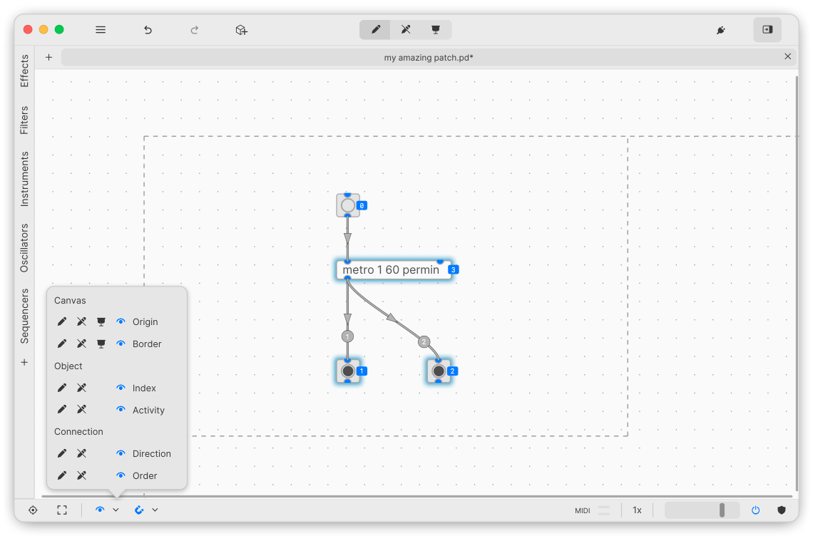
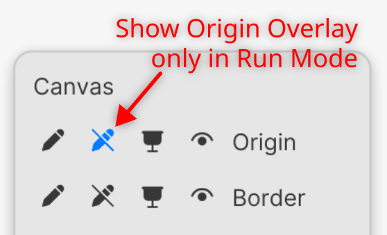
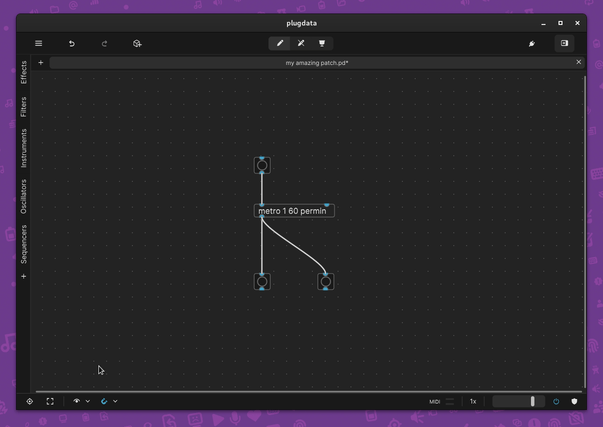
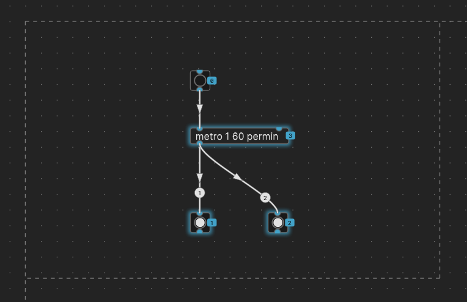
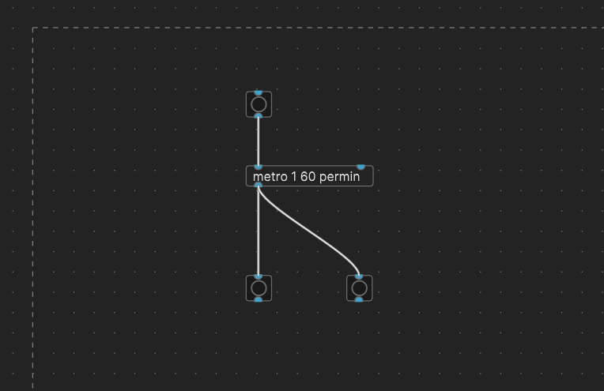
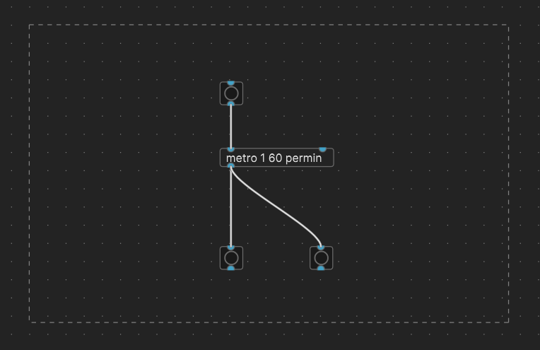
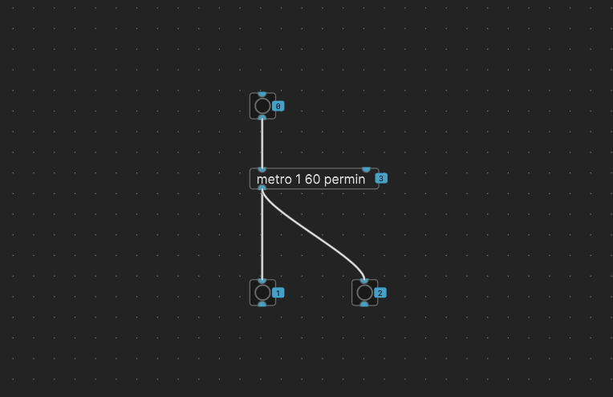
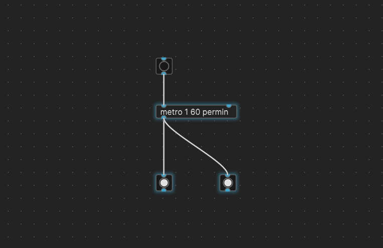
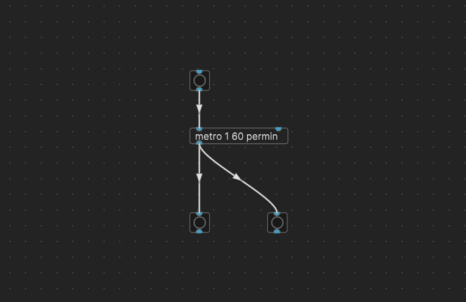
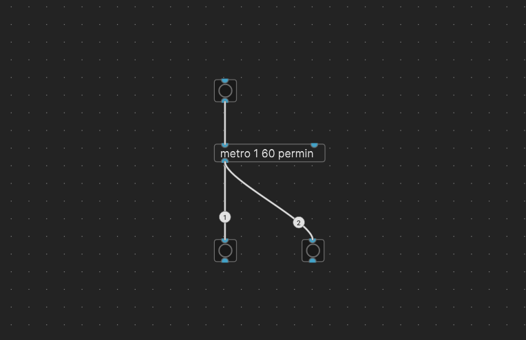

## plugdata Overlay overview:

### Overlays:

The overlay menu allows users to show / hide graphic elements on the canvas.
This menu is divided into 4 rows. Each row relates to the item to the right, and each column shows if the overlay is turned on for that mode. Eg: a grey pencil icon denotes that that overlay is turned off for edit mode. Conversely a lit blue icon represents that the overlay is turned on, here Origin overlay is shown when Run mode is active:

#### Canvas
1) [Origin](#1-canvas---origin)

2) [Border](#2-canvas---border)
#### Object
3) [Index](#3-object---index)

4) [Activity](#4-object---activity)
#### Connection
5) [Directon](#5-connection---direction)

6) [Order](#6-connection---direction)

The eye icon in the status bar turns on / off an additional mode. This is useful if you want to create an overlay collection that you want to show regardless of what mode the canvas is in:

All overlays can be turned on / off independently, or shown all at once, depending on the selected mode, or overlay settings:

#### 1) Canvas - Origin
This overlay allows the user to show where the edge of the puredata canvas is, crossing through the 0,0 point of the canvas. As plugdata uses an infinite canvas to display patches, you are able to move and place objects anywhere. It is useful to see where the top-left of the canvas is, depending on your patching style. :pushpin: when sharing patches with PD-Vanilla, the top-left origin point will be identical to that in PD-Vanilla. However, PD-Vanilla may change the origin point if objects are moved around inside PD-Vanilla editor.

#### 2) Canvas - Border
The border overlay shows the user the patch border. plugdata uses this border to set the size of the displayed window in plugin mode. You can edit the size of the border by right clicking on the canvas, and selecting Properties, then editing the Dimensions (width & height) in the Inspector. The border is always locked to the top-left 0,0 origin point. The user can move UI objects they want to display inside of the border area. In plugin mode anything outside the border will be outside of the plugin window. :pushpin: PD-Vanilla will use the border as the size of it's window when the patch is first launched. This is expected behaviour, the user can scroll around the patch in PD-Vanilla to see different parts of the patch. :warning: If the users resizes the window in PD-Vanilla, the size of the border will change. Keep this in mind if you are intending to use plugin mode in plugdata.

#### 3) Object - Index
plugdata can show the index of the objects inside your patch. This overlay allows you to see a number next to each object which denotes where it is in the object list. This is mainly useful for debugging ordering issues within patches.

#### 4) Object - Activity
When messages are sent between objects, plugdata can visualise the activity by glowing the active objects. This allows the user to see if an object is outputting data when they expect it to. :pushpin: Currently, activity overlay will only show messages between objects that are connected. :warning: This overlay can put extra strain on your CPU, and as such is not recommended to use during performance. :pushpin: Currently this overlay will only show activity of messages, not signal.

#### 5) Connection - Direction
Shows an arrow head in the direction of data flow. This overlay allows the user to quickly see the direction of the cable. In plugdata, objects can be placed anywhere on the canvas, in some situations the receiving object can be placed higher than the sending object.

#### 6) Connection - Order
When an outlet is connected to more than one objects inlet, the messages are sent one at a time. The order of which they are sent is the order in which the connections were added to the patch. This overlay allows the user to see that order, which may be useful to track down bugs in patches. :pushpin: This overlay does not allow editing of the order, it is display only. :warning: It is recommended to use `[trigger]` to control message order.

