## plugdata UI overview:
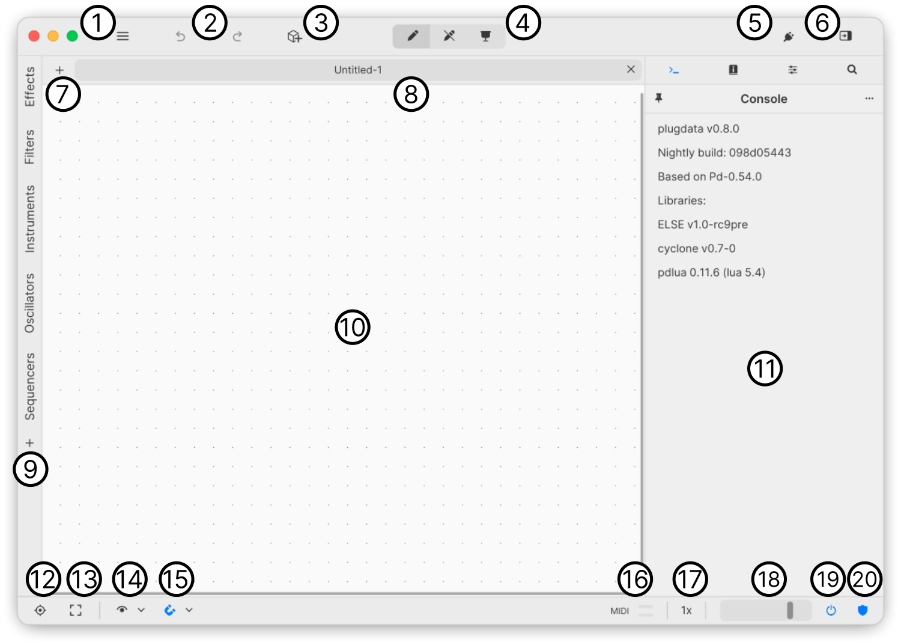

#### Toolbar

1. [Main menu (including save / load)](#1-main-menu)
2. Undo / Redo action on current canvas
3. [Add object menu](#3-add-object-menu)
4. Mode selector: Edit / Run / Presentation
5. Activate plugin mode
6. Close right panel

    #### Tabs

7. Create new patch (tab)
8. Canvas / Patch tab

    #### Palettes

9. [Palette selector](#9-palette-panel)

    #### Canvas

10. [Canvas work area](#10-canvas)

    #### Right panel

11. [Side panel](#11-side-panel)

    #### Statusbar

12. Center canvas view
13. Zoom to fit all objects into view
14. [Overlay selector menu](#14-overlay-selector-menu)
15. [Canvas object snapping menu](#15-canvas-object-snapping-menu)
16. MIDI in/out activity indicator
17. [Oversampling selector](#17-oversampling-menu)
18. Main volume control
19. Audio on/off (blue when on)
20. Limiter (protect output from high volume)

### 1) Main menu:
The main menu allows the user to do file related operations, as well as control and access plugdata settings.

The first section shows plugdata's theme selector, in the example below, the default light theme is selected. Themes can be changed, saved, and restored in the **Themes** section of the **Settings...** menu.

Below the theme selector is a canvas zoom display / control. Use this to change the scale of the currently selected canvas. When working on different patches, the zoom control will reflect the current zoom of the active patch.

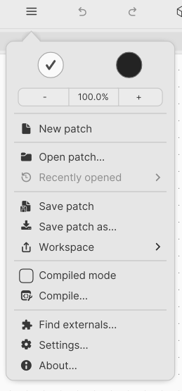

**New patch** Create new .pd patch

**Open patch...** Select .pd patch to open

**Recently opened** Menu shows recent patches

**Save patch** Save the currently selected patch

**Save patch as...** Save the current patch as

**Workspace** Menu allows saving current layout & state of plugdata

**Compile mode** Limits object selection & displays objects that can't be comipiled by the heavy compiler

**Compile** Compile and export current patch using heavy compiler

**Find externals...** Discover and install externals for PD (using deken)

**Setting...** Settings menu: Audio & MIDI, Themes, etc.

**About...** Show information and credits about the installed version of plugdata

### 3) Add object menu:

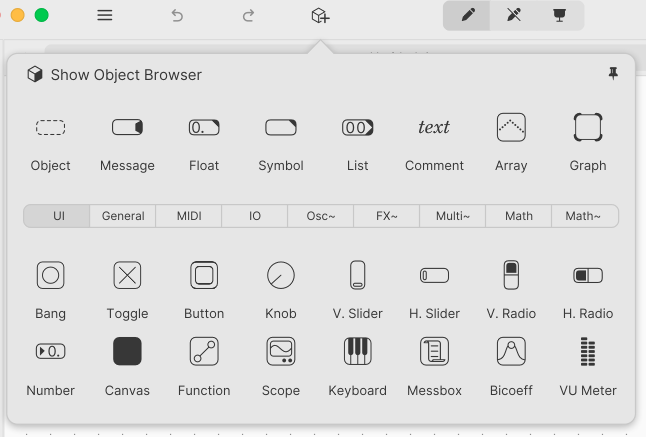

Click and drag any object from this menu into the canvas. This menu shows a small usefull subset of objects, for access to all objects, click on the **Show Object Browser**

**Default objects** The first row of objects are default puredata objects, and are always displayed regardless of the selected category.

**Show Object Browser** will open up the **Object browser** which allows full access and searching of all available objects

**Pin** Will pin the object menu open while dragging and dropping new objects onto the canvas

**Category selector: UI, General, MIDI, IO, Osc~ etc...** Allows the user to change the objects that are displayed for drag and drop using easy to understand categories.

### 9) Palette panel:

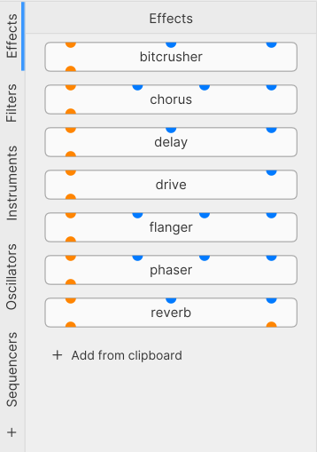

The palette panel can be shown by clicking on any palette category. To hide the panel, simply click on the active category. In the above screenshot, that would be **Effects**.

To use palettes, simply select which category you want to add from, and then drag and drop the item from that category to the canvas.

A user can add as many items to a palette category. To do this first select the objects on the canvas you want to turn into a palette item, and copy them (ctrl+c Windows/Linux, Command+C (⌘+C) macOS).

Then click **Add from clipboard** below the list. This will add the current clipboard contents into the palette. It is helpful to name the new palette item, to allow easy identification in future.

Palette items can be reordered by hovering over an item, and dragging to a new position in the list.

To delete a palette item, again hover over the item, and a close icon will display to the right. :warning: clicking this currently will delete the item.

### 10) Canvas:

plugdata uses an infinite canvas to dispaly PD patches. The coordinate space is  centered on (0,0) origin which is the top-left of the PD-Vanilla patch window, extending negative X to the left, positive X to the right, with up being negative Y. This is because unlike PD-Vanilla, plugdata uses a tabbed interface which means the working canvas area always needs to fill the window area.

The display of both origin and border dashed lines are canvas overlays. See [overlays](#14-overlay-selector-menu) for more info on how to show / hide them.

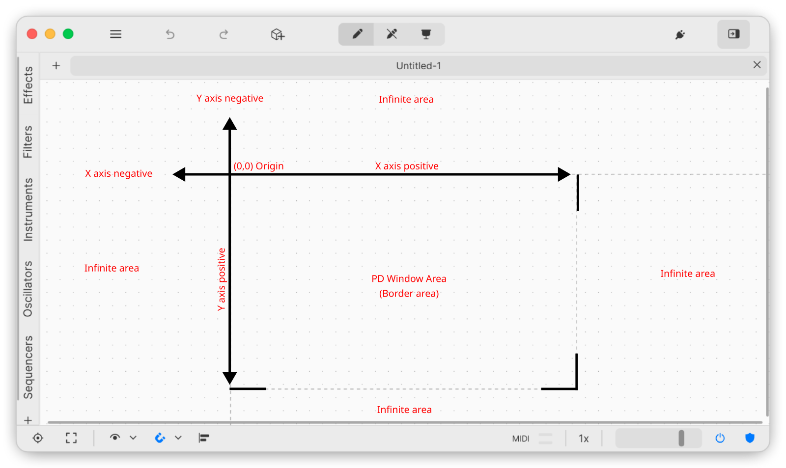

The PD Window area (border overlay) shown below is a representation of what PD-Vanilla will display when opening this patch. By using an infinite canvas model for canvas workspace, the user can freely move between PD-Vanilla and plugdata, and still have access to the size of  the PD window (important for plugin creation, or simply for making sure your patch will display correctly in PD-Vanilla:

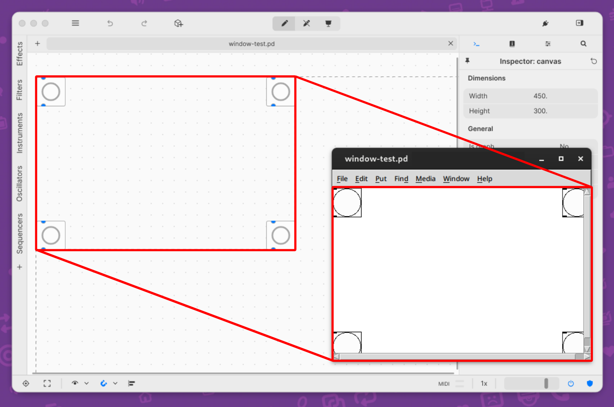

:warning: PD-Vanilla will show scrollbars when canvas elements are near the edge. It is important that plugdata saves the window size 1:1, even if PD-Vanilla chooses to display scrollbars. If this is an issue for your use case, consider adding padding to the right / bottom of the canvas dimensions.

When plugdata is in plugin mode, the border area is used to define the width and height of the plugin. In this way, a user can make plugin GUI's that have custom dimensions, which will be compatible with PD-Vanilla:

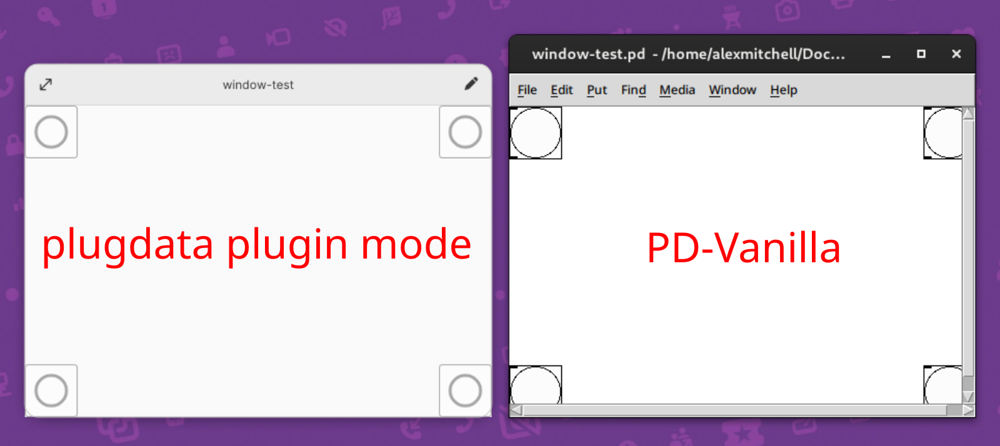

:pushpin: Note that when plugdata is in plugin mode, there are no scrollbars, and the rest of the plugdata editor is hidden. Plugin mode is locked to the size of the PD-Vanilla window border area. And allows the plugin user to concentrate only on the plugins UI.

### 11) Side panel:

The side panel allows the user to show 4 different tabs:

**Console** shows error messages from PD, and also the output of `[print]` object

**Documentation Browser** will display by default the documentation and example directory. A user can also change what file path is dispayed here.

**Automation parameters** a custom list of sliders that are linked to both a `[param]` canvas item of the same name, and when used as a plugin the DAW automation controller.

**Search** Allows easy searching of all objects in the currently selected patch. Use this to find any text / object that is in the current patch.

### Automation parameters:

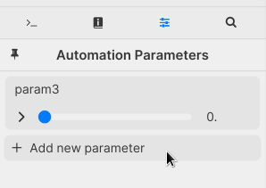

**Add new parameter** allows you to add new parameter automation to plugdata.
This is most useful when plugdata runs as a plugin in a host (such as a Digital Audio Workstation DAW).

Parameters are added with a default name, *param1,2,3 etc* which can be changed by double-clicking on the name area. :warning: Changing the name will not change the name at this point of any parameters already added to the canvas.

Parameters can be added to any canvas by click and dragging over the name area, and dropping into a canavs of your choice.

Clicking the flippy triangle will expose the parameter settings, such as range and mode.

Hovering over the parameter will display a reorder and close icon. Click and drag the reorder icon to reposition the parameter in the list. Click close to remove the parameter from the list.

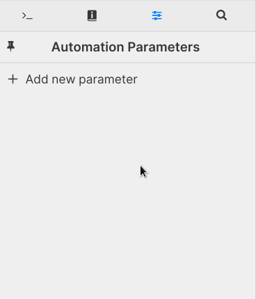

### 14) Overlay selector menu:

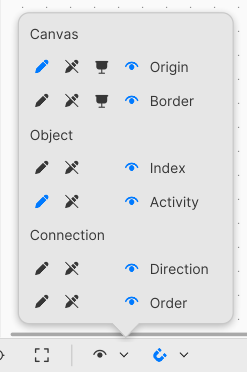

This menu allows the user to turn on and off different infomation graphic elements on the canvas.
Such as showing the canavs origin, or canvas border.
The menu is divided into different sections, which each overlay relates to. Eg: Origin and Border are displays which relate to the canvas.

Each overlay item can be enabled for the currently selected mode. If the canvas is in edit mode (the pencil icon) then turning on the Origin's pencil icon will show the origin overlay in edit mode.

There is a universal control mode, shown as an eye icon. This allows you to turn on that item regardless of which mode the canvas is in.

:pushpin: The eye icon is able to be toggled **on** in the bottom menu (between Zoom to fit all, and Snapping options. :warning: Turning **on/off** the eye icon will override any other mode displays. Even if it is on for Edit & Run mode, if the eye icon is selected for that item, turning it off in the bottom menu will disable it.

For more detailed outline, [see](UI-Overlay-overview.md)

### 15) Canvas object snapping menu:

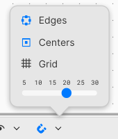

This menu controls the way objects on the canvas snap to each other. The user can select from snapping to **Edges** or **Centers** of other objects on the canvas.

The option **Grid** allows the objects to snap to the canvas grid. The resolution of the canvas grid can also be changed from 5-30 pixels. Changing this value will also update the grid on the canvas, to reflect the size of the grid. :pushpin: this setting will change the resolution of all open patches.

### 17) Oversampling menu:

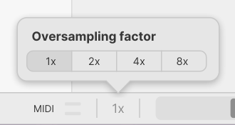

This menu allows the user to change the oversampling factor. Oversampling will make plugdata calculate more samples per second. For example, if plugdata was set to 44.1khz sample rate, 2x would calculate 88.2khz. This improves the quality of some objects, such as patches that include distortion, or non-bandlimited oscillators. :pushpin: Oversampling does not effect the output sample rate, only the internal processing.

