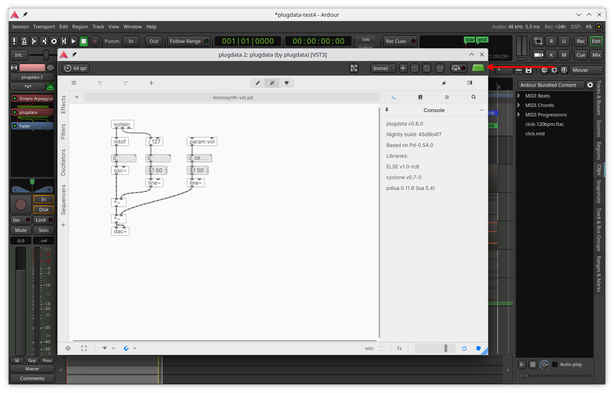
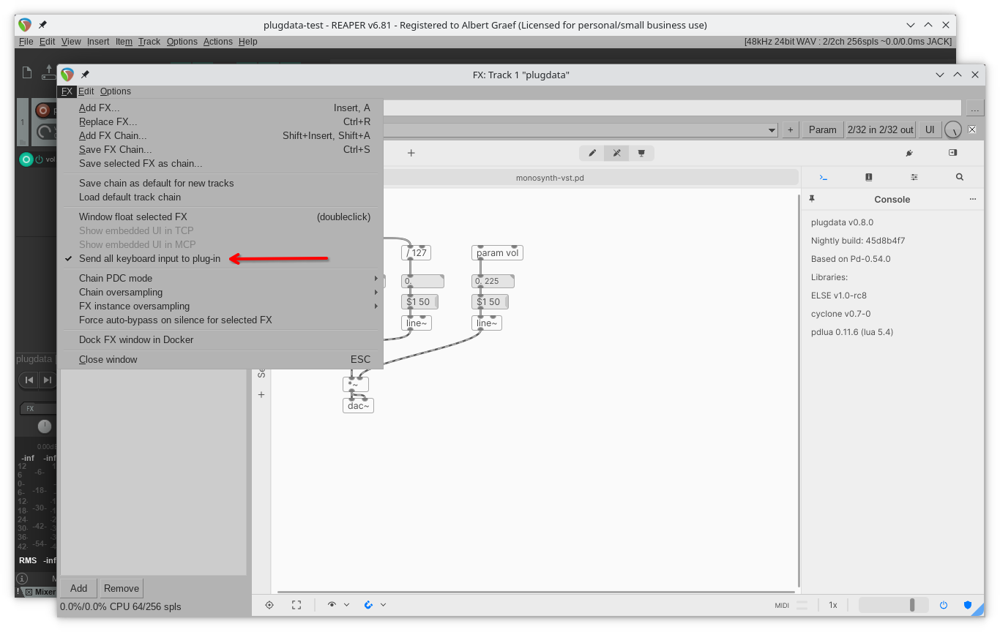

As you probably know, plugdata can run as a plugin in most Digital Audio Workstation (DAW) programs. That is its main purpose after all, although it is also available as a stand-alone application which can run on its own.

To take full advantage of all capabilities of the plugin incarnation, and to be able to edit patches in the plugin window with ease, some DAWs may need to be told to send keyboard input to the plugin window instead of the host application. This is true especially when using plugdata with [Ardour](https://ardour.org/) or [REAPER](https://www.reaper.fm/) on the Mac.

- In Ardour, click on the keyboard icon in the upper right corner of the plugin window:

    

- In REAPER, enable the "Send all keyboard input to plug-in" option in the FX menu of the plugin window:

    

Try this if your keyboard input in the plugin window doesn't appear to work. With those options, plugdata's usual keyboard shortcuts should all work normally, and you should be able to edit object names, properties, parameter names etc. without any problems.
